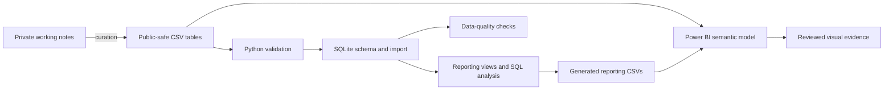

# Music Production Data Lab

[](https://github.com/DataTideHH/music-production-data-lab/actions/workflows/ci.yml)

Public-safe analytics project that transforms semi-structured music-production notes into validated relational data, reproducible Python/SQLite builds, generated SQL reporting outputs and documented Power BI evidence.

Project page: https://datatidehh.github.io/music-production-data-lab/

## Problem and portfolio purpose

Personal working notes about instruments, effects, amplification, recording tools and sound-design workflows are useful to the owner but unsuitable for analysis: naming varies, relationships are implicit, and private details must not be published.

This repository demonstrates a bounded data and process-analysis workflow:

```text
semi-structured domain notes
-> curated public-safe CSV source data
-> documented entities and controlled values
-> validated relational SQLite model
-> SQL reporting views and analytical queries
-> generated reporting datasets
-> Power BI semantic model, DAX and reviewed visual evidence
```

The domain is music production, but the portfolio evidence is transferable: requirements clarification, entity and relationship design, data governance, reproducible processing, dependency analysis, BI modelling and stakeholder-oriented interpretation.

## Current analytical sample

| Entity | Rows |
|---|---:|
| Equipment | 30 |
| Music references | 12 |
| Soundchains/workflows | 12 |
| Ordered equipment uses | 53 |

The sample is deliberately curated. It is large enough to demonstrate relational behaviour without publishing a complete private inventory.

## Current evidence

| Layer | Evidence |
|---|---|
| Source data | Four public-safe CSV tables with stable identifiers and provenance notes |
| Data model | Equipment, references, soundchains and an ordered bridge table |
| Governance | Public/private boundary, controlled values and automated safety checks |
| Python | Dependency-free Python 3.12 build and deterministic reporting workflow |
| SQL | Constrained SQLite schema, reporting views, 16 analytical queries and 17 zero-row quality checks |
| Testing | Database and reporting tests covering success and failure paths |
| CI | Required Ubuntu and Windows jobs on Python 3.12 |
| Reporting | Three generated CSV reporting datasets and a generated Markdown summary |
| Power BI | Existing reviewed overview export, version-controlled DAX and semantic-model documentation |
| Interpretation | Written findings connecting reuse, coverage, complexity and quality status |

Generated SQLite databases and Power BI working files are local artifacts and are not committed.

## Architecture



The central many-to-many relationship is:

```text
equipment 1 -> n soundchain_equipment n <- 1 soundchains
                                        n -> 1 music_references
```

See [Data model](docs/data-model.md), [Data dictionary](docs/data-dictionary.md) and [Power BI semantic model](powerbi/model.md).

## Repository structure

```text
music-production-data-lab/
├── .github/workflows/ci.yml
├── README.md
├── data/
│   ├── public/
│   │   ├── equipment_public.csv
│   │   ├── music_references_public.csv
│   │   ├── soundchains_public.csv
│   │   └── soundchain_equipment_public.csv
│   ├── processed/
│   │   ├── analysis_summary.csv
│   │   ├── equipment_usage_summary.csv
│   │   └── soundchain_analysis.csv
│   └── private/.gitkeep
├── docs/
│   ├── findings.md
│   ├── generated-analysis-summary.md
│   ├── images/
│   │   ├── powerbi-overview.png
│   │   ├── analysis-soundchain-preview.svg
│   │   └── analysis-data-quality-preview.svg
│   ├── index.md
│   ├── data-model.md
│   ├── data-dictionary.md
│   ├── testing-and-ci.md
│   └── publication-policy.md
├── powerbi/
│   ├── README.md
│   ├── measures.dax
│   └── model.md
├── scripts/
│   ├── build_database.py
│   └── generate_analysis_report.py
├── sql/
│   ├── schema.sql
│   ├── example_queries.sql
│   └── data_quality_queries.sql
└── tests/
    ├── test_build_database.py
    └── test_generate_analysis_report.py
```

## Quick start

Requirements:

- Python 3.12
- no third-party Python packages

macOS/Linux:

```bash
python3.12 -m unittest discover -s tests -p "test_*.py" -v
python3.12 scripts/build_database.py
python3.12 scripts/generate_analysis_report.py
```

Windows PowerShell:

```powershell
py -3.12 -m unittest discover -s tests -p "test_*.py" -v
py -3.12 scripts\build_database.py
py -3.12 scripts\generate_analysis_report.py
```

Default generated database:

```text
db/music_production_data_lab.sqlite
```

The reporting generator rebuilds these committed outputs deterministically:

```text
data/processed/analysis_summary.csv
data/processed/equipment_usage_summary.csv
data/processed/soundchain_analysis.csv
docs/generated-analysis-summary.md
```

CI regenerates these four reporting outputs and fails when the committed versions are stale. The two SVG page previews are separately reviewed visual-design evidence based on the same validated metrics; they are not generated by the reporting script.

## Key findings

The current public sample shows:

- 24 of 30 equipment records are used in at least one workflow: 80% coverage.
- 16 equipment records are reused across two or more workflows.
- the SD-1 Super OverDrive and UR22C are the most reused records, with five workflows each.
- recording workflows account for four of 12 soundchains and include the two largest workflows.
- 39 of 53 equipment uses are required, 11 optional and three swap candidates.
- 19 equipment records are verified, ten remain sample-level and one needs verification.

See [Analysis findings and interpretation](docs/findings.md) and the [generated summary](docs/generated-analysis-summary.md).

## Power BI evidence

### Reviewed overview export


### Soundchain Analysis preview


### Data Quality and Coverage preview


The two SVGs are reviewed, data-backed design previews of the intended Power BI pages. They are explicitly labelled as previews and are not represented as `.pbix` exports. The existing PNG is the reviewed Power BI overview export. The source metrics behind the previews are reproducibly generated and checked by CI.

Version-controlled BI evidence:

- [DAX measures](powerbi/measures.dax)
- [Semantic-model documentation](powerbi/model.md)
- [Power BI evidence notes](powerbi/README.md)

## What the build validates

The build fails on:

- missing or structurally changed CSV files
- empty required values
- duplicate business keys
- invalid controlled values
- inconsistent hardware/software classification
- non-positive, duplicate or non-contiguous positions
- orphan relationships
- direct instrument/output relationships missing from the bridge
- non-public privacy classifications
- selected sensitive-term, currency-like and serial-like patterns
- SQLite integrity or foreign-key errors
- any SQL data-quality query returning rows

The public-safety validation is a portfolio safeguard, not a claim that automated scanning can replace human review.

## Public/private boundary

Only curated public-safe sample data belongs in `data/public/`.

The repository must not contain:

- complete private inventories
- invoices, prices or purchase dates
- serial numbers
- private condition or storage notes
- original private source documents
- unreviewed Power BI working files or screenshots

Protected local folders and file types are defined in `.gitignore`. See [Publication policy](docs/publication-policy.md).

## Reviewer path

A reviewer can assess the project in a few minutes:

1. Read the [project page](https://datatidehh.github.io/music-production-data-lab/).
2. Review the [generated analysis summary](docs/generated-analysis-summary.md).
3. Inspect the [findings and interpretation](docs/findings.md).
4. Inspect the [ER model](docs/data-model.md) and [semantic model](powerbi/model.md).
5. Run the tests, database build and reporting generator.
6. Review the [analytical SQL](sql/example_queries.sql) and [DAX measures](powerbi/measures.dax).
7. Inspect the reviewed overview and the two clearly labelled analytical previews.

## Current and deferred scope

### Implemented

- expanded curated public sample
- relational SQLite schema and reporting views
- Python build and validation
- generated reporting datasets
- analytical and data-quality SQL
- automated unit tests and cross-platform CI
- Power BI semantic-model and DAX documentation
- reviewed overview export and two data-backed analytical design previews
- written findings and GitHub Pages documentation

### Deferred

- replacing the two static previews with reviewed exports from the updated local `.pbix`
- Streamlit explorer
- additional API layer

An API is not required for the current analytical objective; the separate `spring-boot-process-api-basics` repository already provides API evidence within the broader DataTideHH portfolio.

## Related DataTideHH projects

- [Network Operations Data Lab](https://datatidehh.github.io/network-operations-data-lab/) — operational IT data, Python, SQL and quality reporting
- [Hamburg District Data Basics](https://github.com/DataTideHH/hamburg-district-data-basics) — public/open-data analysis and Power BI preparation
- [Open-Meteo Germany Weather Ranking](https://github.com/DataTideHH/open-meteo-germany-weather-ranking) — API, JSON, scoring and tested Python workflow
- [Spring Boot Process API Basics](https://datatidehh.github.io/spring-boot-process-api-basics/) — Java/Spring API evidence supporting, rather than duplicating, this analytics project
