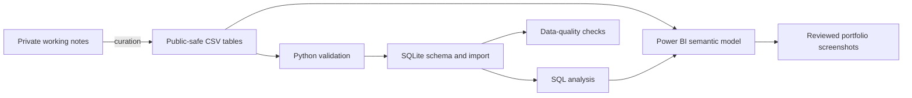

# Music Production Data Lab

[](https://github.com/DataTideHH/music-production-data-lab/actions/workflows/ci.yml)

Public-safe analytics project that transforms semi-structured music-production notes into validated relational data, reproducible Python/SQLite builds, SQL analysis and Power BI reporting evidence.

Project page: https://datatidehh.github.io/music-production-data-lab/

## Problem and portfolio purpose

Personal working notes about instruments, effects, amplification, recording tools and sound-design workflows are useful to the owner but unsuitable for analysis: naming varies, relationships are implicit, and private details must not be published.

This repository demonstrates a bounded data and process-analysis workflow:

```text
semi-structured domain notes
-> curated public-safe CSV source data
-> documented entities and controlled values
-> validated relational SQLite model
-> SQL analysis and data-quality checks
-> Power BI reporting layer
```

The domain is music production, but the portfolio evidence is transferable: requirements clarification, entity and relationship design, data governance, reproducible processing, validation, analysis and stakeholder-oriented documentation.

## Current evidence

| Layer | Evidence |
|---|---|
| Source data | Four curated public-safe CSV tables with stable identifiers |
| Data model | Equipment, music references, soundchains and a bridge table |
| Governance | Explicit public/private boundary and automated safety checks |
| Python | Dependency-free Python 3.12 build and validation workflow |
| SQL | Constrained SQLite schema, analytical queries and zero-row quality checks |
| Testing | 12 unit tests covering success and failure paths |
| CI | Ubuntu and Windows jobs on Python 3.12 |
| BI | Public-safe Power BI overview screenshot and documented semantic-model plan |
| Documentation | GitHub Pages, ER diagram, data dictionary and reviewer path |

Generated SQLite databases and Power BI working files are local artifacts and are not committed.

## Architecture



The central many-to-many relationship is:

```text
soundchains
    1 -> n
soundchain_equipment
    n -> 1
equipment
```

See [Data model](docs/data-model.md) and [Data dictionary](docs/data-dictionary.md).

## Repository structure

```text
music-production-data-lab/
├── .github/workflows/ci.yml
├── README.md
├── data/
│   ├── public/
│   │   ├── equipment_public.csv
│   │   ├── music_references_public.csv
│   │   ├── soundchains_public.csv
│   │   └── soundchain_equipment_public.csv
│   └── private/.gitkeep
├── docs/
│   ├── assets/css/style.scss
│   ├── images/powerbi-overview.png
│   ├── index.md
│   ├── data-model.md
│   ├── data-dictionary.md
│   ├── testing-and-ci.md
│   ├── publication-policy.md
│   ├── power-bi-plan.md
│   └── official-references.md
├── scripts/
│   └── build_database.py
├── sql/
│   ├── schema.sql
│   ├── example_queries.sql
│   └── data_quality_queries.sql
└── tests/
    └── test_build_database.py
```

## Quick start

Requirements:

- Python 3.12
- no third-party Python packages

macOS/Linux:

```bash
python3.12 -m unittest discover -s tests -p "test_*.py" -v
python3.12 scripts/build_database.py
```

Windows PowerShell:

```powershell
py -3.12 -m unittest discover -s tests -p "test_*.py" -v
py -3.12 scripts\build_database.py
```

Default generated database:

```text
db/music_production_data_lab.sqlite
```

A custom existing output file is not replaced unless `--overwrite` is passed:

```bash
python3.12 scripts/build_database.py --db /tmp/music-lab.sqlite
python3.12 scripts/build_database.py --db /tmp/music-lab.sqlite --overwrite
```

## What the build validates

The build fails on:

- missing or structurally changed CSV files
- empty required values
- duplicate business keys
- invalid controlled values
- inconsistent hardware/software classification
- non-positive or duplicate positions in a soundchain
- orphan relationships
- non-public privacy classifications
- selected sensitive-term, currency-like and serial-like patterns
- SQLite integrity or foreign-key errors
- any SQL data-quality query returning rows

The public-safety validation is a portfolio safeguard, not a claim that automated scanning can replace human review.

## Current analytical questions

The committed SQL layer answers questions such as:

- Which equipment categories are represented?
- Which items are reused across the most workflows?
- How many required and optional steps exist?
- Which soundchains are more complex?
- Which equipment records are not yet used in a soundchain?
- Which sound axes and reference groups are represented?

The next analytical increment will expand the curated sample and publish stronger Power BI measures, screenshots and written findings.

## Public/private boundary

Only curated public-safe sample data belongs in `data/public/`.

The repository must not contain:

- complete private inventories
- invoices, prices or purchase dates
- serial numbers
- private condition or storage notes
- original private source documents
- unreviewed Power BI files or screenshots

Protected local folders and file types are defined in `.gitignore`. See [Publication policy](docs/publication-policy.md).

## Reviewer path

A reviewer can assess the project in a few minutes:

1. Read the [project page](https://datatidehh.github.io/music-production-data-lab/).
2. Inspect the [ER model](docs/data-model.md).
3. Review the [controlled values and quality rules](docs/data-dictionary.md).
4. Run the tests and reproducible database build.
5. Inspect [analytical SQL](sql/example_queries.sql) and [quality checks](sql/data_quality_queries.sql).
6. Review the [Power BI plan](docs/power-bi-plan.md) and published overview.

## Current, next and deferred scope

### Implemented

- public-safe CSV source data
- relational SQLite schema
- Python build and validation
- SQL analysis and data-quality checks
- automated unit tests
- cross-platform GitHub Actions
- initial Power BI overview
- GitHub Pages documentation

### Next

- enlarge the curated public sample without publishing the full private inventory
- add richer analytical SQL outputs
- document DAX measures and the semantic model
- publish two or three reviewed Power BI pages with written findings

### Deferred

- Streamlit explorer
- additional API layer

An API is not required for the current analytical objective; the separate `spring-boot-process-api-basics` repository already provides API evidence within the broader DataTideHH portfolio.

## Related DataTideHH projects

- [Network Operations Data Lab](https://datatidehh.github.io/network-operations-data-lab/) — operational IT data, Python, SQL and quality reporting
- [Hamburg District Data Basics](https://github.com/DataTideHH/hamburg-district-data-basics) — public/open-data analysis and Power BI preparation
- [Open-Meteo Germany Weather Ranking](https://github.com/DataTideHH/open-meteo-germany-weather-ranking) — API, JSON, scoring and tested Python workflow
- [Spring Boot Process API Basics](https://datatidehh.github.io/spring-boot-process-api-basics/) — Java/Spring API evidence supporting, rather than duplicating, this analytics project
