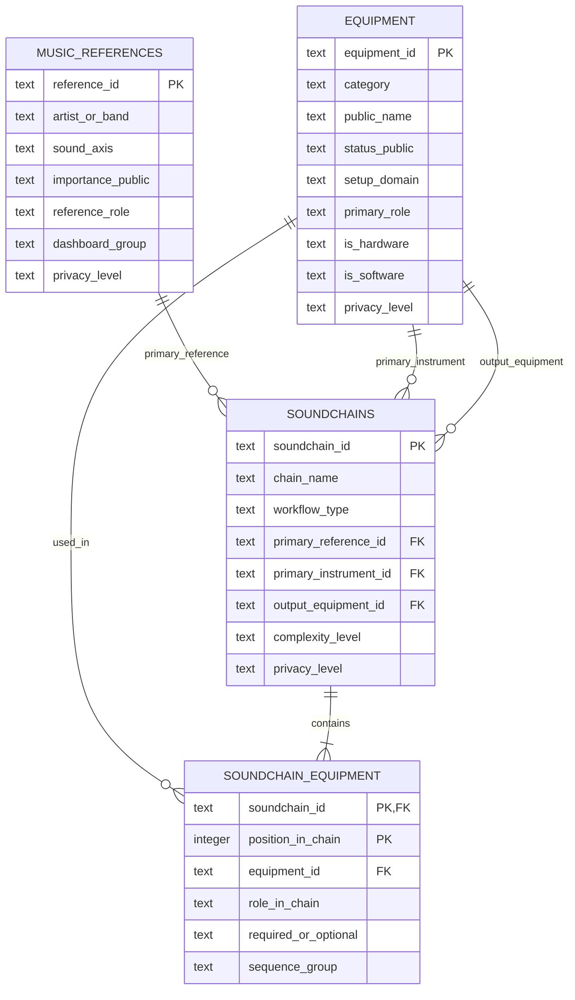

# Data model

The repository models a curated public sample of music-production equipment, references and workflows. The current state is relational and executable: the CSV files are validated, imported into SQLite and checked by SQL.

## Entity relationship model



## Core entities

### `equipment`

Public-safe equipment and software records. `equipment_id` is the stable key. Exactly one of `is_hardware` and `is_software` must be true.

### `music_references`

Reference artists or bands mapped to sound axes, learning goals and production concepts.

### `soundchains`

Workflow concepts such as guitar signal chains or recording workflows. A soundchain may have one primary reference, one primary instrument and one output item.

### `soundchain_equipment`

Bridge table connecting soundchains and equipment in an ordered sequence. The current business rule permits one item per `position_in_chain` within a soundchain, so the primary key is:

```text
soundchain_id + position_in_chain
```

## Relationship decisions

The bridge table is the principal relationship for equipment usage. The direct `primary_instrument_id` and `output_equipment_id` links describe special roles and may be inactive role-playing relationships in Power BI to avoid ambiguous filter paths.

The current model deliberately keeps one `primary_reference_id` per soundchain. A later analytical extension may add a `soundchain_references` bridge when multiple references need to be represented.

## Data flow

```text
data/public/*.csv
-> Python structural and business-rule validation
-> SQLite tables and constraints
-> analytical SQL
-> zero-row data-quality checks
-> Power BI semantic model
```

## Boundaries

This is a normalized analytical sample, not a complete asset register. Private source material, prices, serial numbers, purchase information and storage details remain outside the repository.
