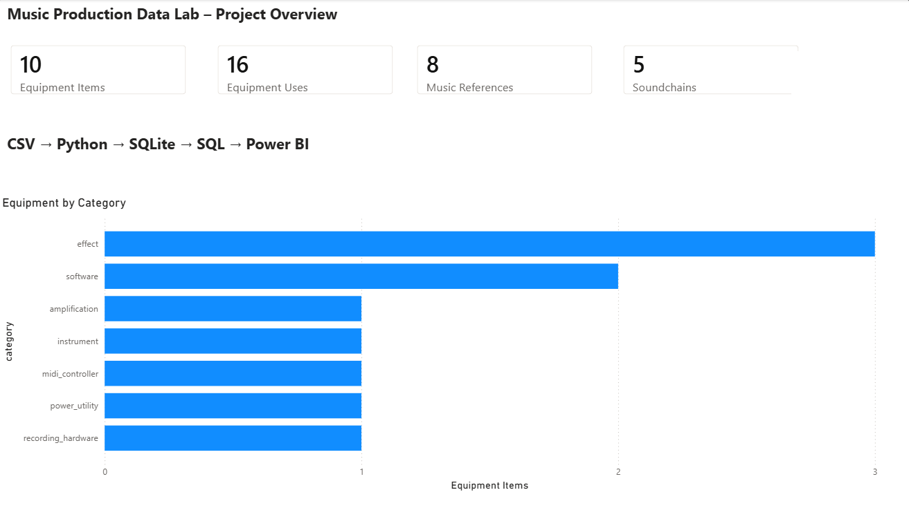

# Music Production Data Lab

**Public-safe data modeling project turning semi-structured music production notes into structured CSV data, a relational model, SQL queries, a Python build workflow and a Power BI reporting layer.**

[View repository](https://github.com/DataTideHH/music-production-data-lab) · [Read the full README](https://github.com/DataTideHH/music-production-data-lab/blob/main/README.md) · [DataTideHH portfolio](https://datatidehh.de/)

---

## Project purpose

This project demonstrates how real-world domain knowledge can be transformed into a small, documented data product.

The source domain is a music production setup, but the portfolio focus is data and process analysis:

- turn semi-structured working notes into clean tabular data
- define stable IDs, categories and relationships
- separate public-safe sample data from private source material
- build a relational model with SQLite and SQL
- validate data quality with reproducible checks
- prepare a Power BI reporting layer for communication and review

---

## Workflow

```text
Unstructured notes
-> curated public-safe CSV files
-> documented data model
-> SQLite schema and database build
-> SQL analysis and data-quality checks
-> Power BI overview dashboard
```

---

## Current portfolio artifacts

| Artifact | What it shows |
|---|---|
| [CSV schema](csv-schema.md) | Public-safe table structure and field documentation |
| [Data model](data-model.md) | Conceptual model, entities and relationships |
| [SQLite model notes](sqlite-model-notes.md) | Relational preparation and database design notes |
| [Python import notes](python-import-notes.md) | Reproducible CSV-to-SQLite build workflow |
| [Power BI plan](power-bi-plan.md) | Planned dashboard pages, relationships and measures |
| [Publication policy](publication-policy.md) | Public/private boundary and portfolio safety rules |

---

## Data model focus

The central modeling challenge is the relationship between equipment, music references, soundchains and practical workflows.

The current public model includes four main CSV tables:

| Table | Role |
|---|---|
| `equipment_public.csv` | Public-safe equipment dimension table |
| `music_references_public.csv` | Reference artists, sound axes and learning goals |
| `soundchains_public.csv` | Workflow or signal-chain concepts |
| `soundchain_equipment_public.csv` | Bridge table connecting soundchains and equipment |

This makes the project useful for practicing many-to-many relationships, data-quality checks and BI-style reporting preparation.

---

## Power BI overview

The first public-safe Power BI overview page summarizes the current sample model as a small data product.



The `.pbix` file remains private. Only reviewed public-safe screenshots are published.

---

## What this demonstrates

- structured data modeling from messy source material
- public/private data separation
- relational thinking with stable identifiers and bridge tables
- SQL and Python build workflow documentation
- data-quality awareness
- Power BI dashboard preparation
- clear portfolio communication for Data/BI and process-analysis roles

---

## Related DataTideHH project pages

- [Network Operations Data Lab](https://datatidehh.github.io/network-operations-data-lab/) — public-safe operational IT data, Python, SQL and data-quality workflow
- [Spring Boot Process API Basics](https://datatidehh.github.io/spring-boot-process-api-basics/) — small Java/Spring REST API for structured process-check data

---

## Next steps

The next useful project steps are:

1. refine the Power BI overview into a small multi-page dashboard
2. add one exported reporting dataset from SQL queries
3. document the dashboard interpretation for a recruiter or technical reviewer
4. keep the project aligned with the broader DataTideHH portfolio structure
