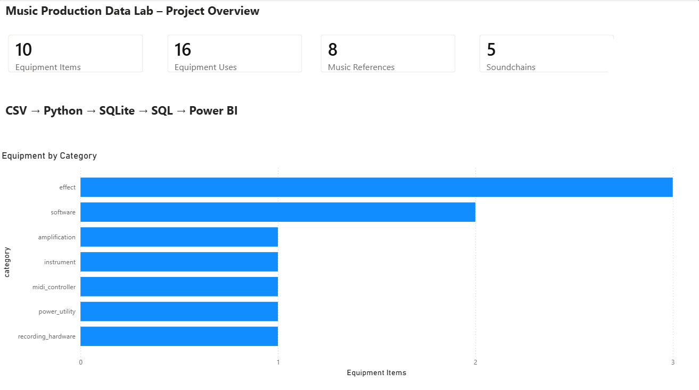
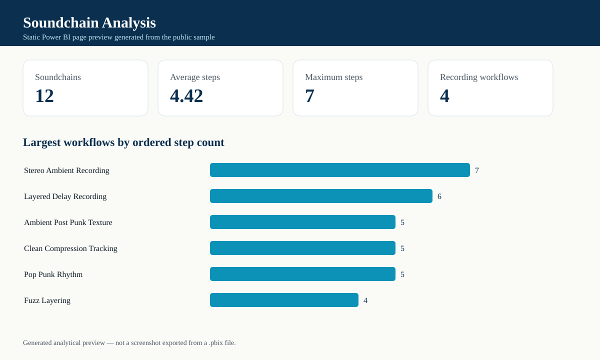
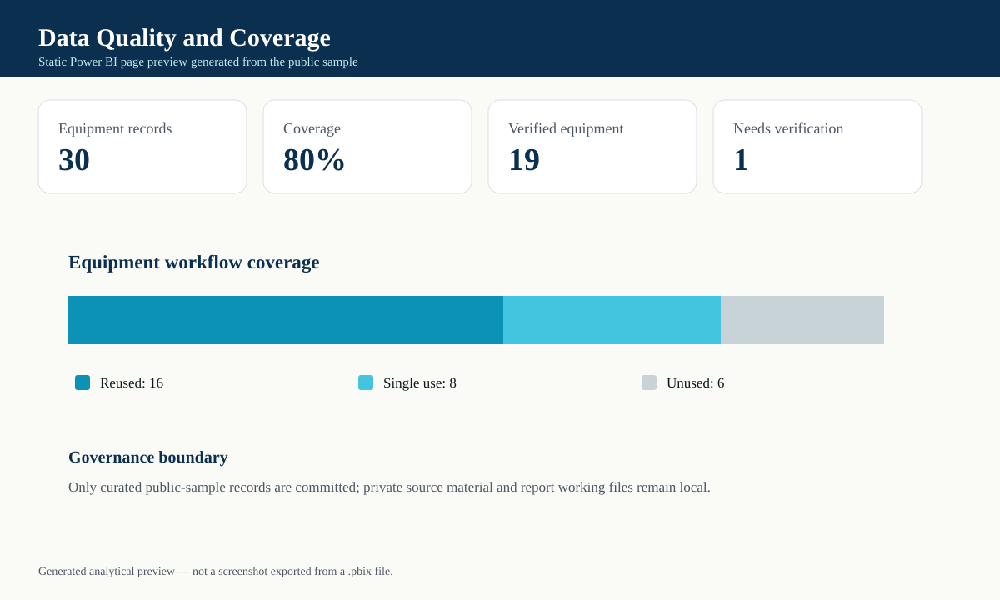

# Music Production Data Lab

**Public-safe relational data model with a reproducible Python/SQLite workflow, SQL reporting views, automated data-quality checks, and a documented Power BI semantic model with version-controlled DAX measures**

[View repository](https://github.com/DataTideHH/music-production-data-lab) · [Read the full README](https://github.com/DataTideHH/music-production-data-lab/blob/main/README.md) · [DataTideHH portfolio](https://datatidehh.de/)

---

## Project purpose

The source domain is a music-production setup, but the portfolio focus is Data/BI and process analysis:

- turn semi-structured domain notes into controlled tabular data
- model equipment, references and workflows through stable identifiers
- validate relationships, quality status and publication boundaries
- build a reproducible SQLite data product
- generate reporting datasets from SQL-backed views
- document a Power BI semantic model and DAX layer
- interpret results for a technical or non-technical reviewer

---

## Current sample

| Entity | Rows |
|---|---:|
| Equipment | 30 |
| Music references | 12 |
| Soundchains | 12 |
| Ordered equipment uses | 53 |

The sample is curated and public-safe. It is not a complete private inventory.

---

## Key metrics

| Metric | Result |
|---|---:|
| Equipment workflow coverage | 80% |
| Reused equipment items | 16 |
| Recording workflows | 4 |
| Average steps per soundchain | 4.42 |
| Maximum steps | 7 |
| Equipment items needing verification | 1 |

[Read the generated analysis summary](generated-analysis-summary.md) · [Read the findings](findings.md)

---

## Reporting workflow

```text
public CSV source data
-> Python validation
-> SQLite relational model
-> reporting views and analytical SQL
-> generated reporting CSVs
-> Power BI semantic model and DAX
-> reviewed visual evidence
```

---

## Power BI evidence

### Existing reviewed overview



### Soundchain Analysis preview



### Data Quality and Coverage preview



The two SVG pages are deterministic, data-backed previews and are not represented as screenshots exported from a `.pbix` file.

---

## Portfolio artifacts

| Artifact | What it demonstrates |
|---|---|
| [Generated analysis summary](generated-analysis-summary.md) | Reproducible metrics and ranked outputs |
| [Findings and interpretation](findings.md) | Business-readable interpretation of reuse, complexity and quality |
| [Data model](data-model.md) | Entities, bridge table and relationship decisions |
| [Data dictionary](data-dictionary.md) | Controlled values and validation rules |
| [Testing and CI](testing-and-ci.md) | Cross-platform reproducibility and stale-output detection |
| [Power BI plan](power-bi-plan.md) | Page goals and reporting questions |
| [Power BI model](https://github.com/DataTideHH/music-production-data-lab/blob/main/powerbi/model.md) | Relationships, active/inactive paths and data types |
| [DAX measures](https://github.com/DataTideHH/music-production-data-lab/blob/main/powerbi/measures.dax) | Version-controlled BI calculations |
| [Publication policy](publication-policy.md) | Public/private boundary |

---

## Main findings

- 24 of 30 equipment records are used in at least one workflow.
- shared platform items create the highest reuse across workflows.
- recording workflows are fewer but include the largest chains.
- required, optional and swap-candidate roles support dependency analysis.
- quality status is exposed to reporting instead of being hidden.

---

## Related DataTideHH project pages

- [Network Operations Data Lab](https://datatidehh.github.io/network-operations-data-lab/) — operational IT data, Python, SQL and data quality
- [Spring Boot Process API Basics](https://datatidehh.github.io/spring-boot-process-api-basics/) — Java/Spring process API evidence
